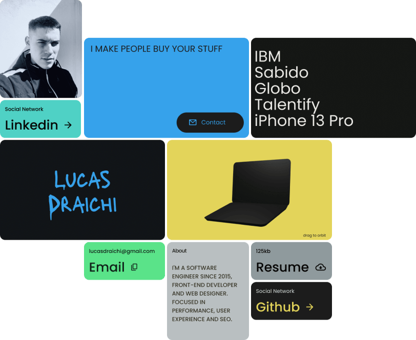

# :rage1: Draichiboard :hurtrealbad:


<div align="center">
  
</div>

My portfolio and personal dashboard.

Full design files in <a href="https://www.figma.com/file/EqOWp6LXEIl808ZtiIOapW/Draichiboard?node-id=478%3A44&t=LH2joCCGq4umuUjc-1">Figma</a>

## Prerequisites

- Node 18.xx
- Yarn 1.xx

## Setup

```sh
# dev
yarn && yarn dev

# prod
yarn build && yarn preview
```
